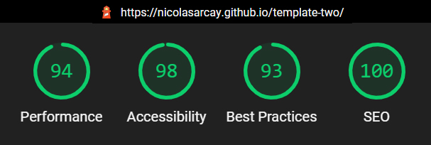
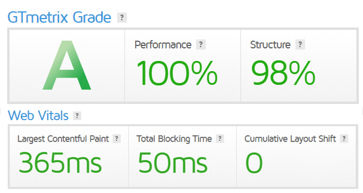

  

<h3 align="center"> Template en Bootstrap 4.6</h3>

  Demostracion en vivo.
   
  <a href="https://nicolasarcay.github.io/template-two/"> Ver Template</a>
   

<h2 align="center"> Performance en Google Lighthouse</h2>

    

<h2 align="center"> Performance en GTMetrix</h2>

    

  Maquetador Web, HTML5, CSS3, Bootstrap 4.5, Sass.
   
  <a href="https://www.nicolasarcay.com"><strong>Explore Portfolio »</strong></a>
   
   
  <a href="https://github.com/nicolasarcay?tab=repositories">Github</a>

